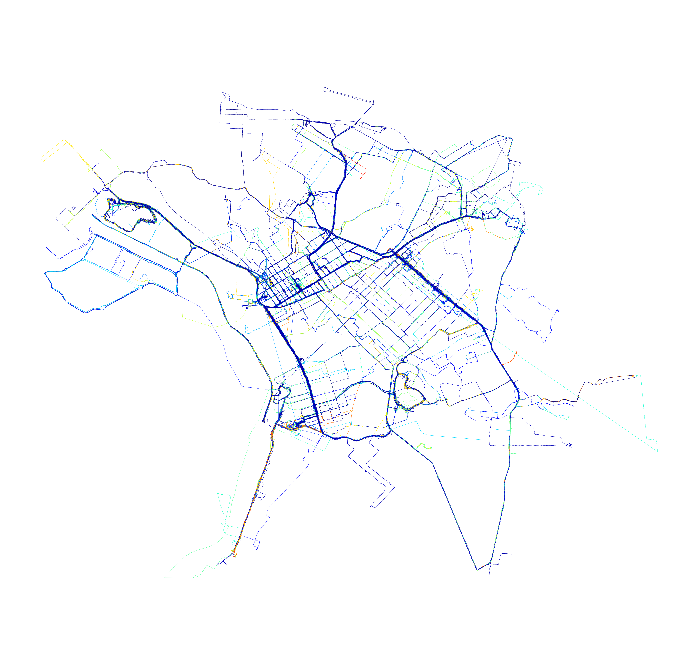

# Raw data importing
Our primary goal here is to import, interpolate, and extend our bike riding GPS data. It'll be somewhat complicated as it is not small task on code, but using vectorization on all processes will keep execution really fast. We have for this task about 1.7M datapoints. Each datapoint corresponds to a fancy **one point in space time**, i.e. one point made of 4 dimensions of timestamp, latitude, longitude and elevation. We hope that connection each one sequentially on time will render a path that a biker rode. To guarantee bookeeping and post processing capabilities, we will record the point id, ride id and rider id.


```python
# import needed packages
import gpxpy
import datetime 
import time
import matplotlib.pyplot as plt
import matplotlib.colors as colors
import os
import numpy as np
import re
import sys
import pandas as pd
import pickle as pk
from tqdm import tqdm_notebook as tqdm
from geopy.distance import great_circle
# from scipy.signal import gaussian
# from scipy.ndimage import filters
from scipy.ndimage.filters import gaussian_filter
from mpl_toolkits.axes_grid1 import make_axes_locatable
import nvector as nv
from pandas.plotting import andrews_curves
```


```python
# import the gpx data
gpx_filename_pattern = re.compile("(gpx)$")
def build_meta(gpx): 
    meta = {
        "tracks": 0,
        "segments": 0,
        "points": 0
    }
    for track in gpx.tracks:
        meta["tracks"] += 1
        for segment in track.segments:
            meta["segments"] += 1
            for point in segment.points:
                meta["points"] += 1
    return meta

def import_gpx_file(path, filename):
    build_meta
    file = open(path+'/'+filename, 'r')
    gpx = gpxpy.parse(file)
    meta = build_meta(gpx)
    data = np.zeros((meta['points'], 5))
    n = 0
    for track in gpx.tracks:
        for segment in track.segments:
            for point in segment.points:
                t = time.mktime(point.time.timetuple())
                data[n, ] = [point.latitude, point.longitude, point.elevation, t, n]
                n += 1
    return pd.DataFrame({
        'latitude': data[:,0],
        'longitude': data[:,1],
        'elevation': data[:,2],
        'timestamp': data[:,3],
        'point': data[:,4],
        'ride': 0,
        'rider': ""
    })

def import_gpx_dir(path):
    filenames = [f for f in os.listdir(path) if gpx_filename_pattern.search(f)]    
    data = pd.DataFrame()
    n = 0
    for filename in tqdm(filenames, total=len(filenames)):
        dt = import_gpx_file(path, filename)
        dt['ride'] = n
        n += 1
        data = data.append(dt, ignore_index=True)
    return data

def interpret_gpx(path, name):
    data = import_gpx_dir(path)
    data["rider"] = name
    data.elevation = data.elevation.astype(int)
    data.timestamp = data.timestamp.astype(int)
    data.point = data.point.astype(int)
    #save to cache
    cache = open(str(name)+'.pkl', 'wb')
    pk.dump(data, cache)
    cache.close()
    return data

def load_gpx(path):
    cache = open(path, 'rb')
    data = pk.load(cache)
    cache.close()
    return data

def save_data(data, name):
    cache = open(name+".pkl", 'wb')
    pk.dump(data, cache)
    cache.close()
    
def load_data(name):
    cache = open(name+".pkl", 'rb')
    data = pk.load(cache)
    cache.close()
    return data

if(os.path.exists("0.pkl")):
    data1 = load_gpx("0.pkl")
    data2 = load_gpx("1.pkl")
else:
    data1 = interpret_gpx("/Users/esse/activ/rodrigo_sztelzer", 0)
    data2 = interpret_gpx("/Users/esse/activ/marcos_paulo", 1)

imported = data1.append(data2, ignore_index=True)
print(imported.shape)
```

    (1739684, 7)


# Data preprocessing
There will have some steps to have a gooda data shaped to most processes. The idea is to cleanup dirt distances introduced by bad GPS and interpolate the points as to make all rows 1 meter of distance, that will simplify most phisical calculations.

####  Create destination columns
This will transform the list in a origin/destination list of points, so the resulting list is [M-1, N*2]. These new columns are equal to the next row. Finally remove the last element of each ride that has value zero.


```python
def haversine(lon1, lat1, lon2, lat2):
    lon1, lat1, lon2, lat2 = map(np.radians, [lon1, lat1, lon2, lat2])
    a = np.sin((lat2-lat1)/2.0)**2 + np.cos(lat1) * np.cos(lat2) * np.sin((lon2-lon1)/2.0)**2
    return 6372800 * 2 * np.arcsin(np.sqrt(a))

def destiny(dt):
    # create a column with the next points
    dt = dt.sort_values(['timestamp'])
    dt['duration'] = np.roll(dt.timestamp, -1) - dt['timestamp']
    dt.drop(dt.tail(1).index, inplace=True) 

    #repeat the data, set repeats to nan, interpolate nans.
    dt = dt.loc[dt.index.repeat(dt.duration)]   # repeat rows n times based on n duration
    dt['subindex'] = dt.groupby(level=0).cumcount() # creat an intern index of the repeats
    dt[dt.subindex > 0] = np.nan
    dt = dt.interpolate()                           # interpolate the nans
    dt = dt.reset_index()
    del(dt['index'])
    del(dt['duration'])
    del(dt['subindex'])

    dt['ilon'] = dt['longitude']
    dt['ilat'] = dt['latitude']
    dt['ielev'] = dt['elevation']
    dt['itime'] = dt['timestamp']
    dt['flon'] = np.roll(dt.longitude, -1)
    dt['flat'] = np.roll(dt.latitude, -1)
    dt['felev'] = np.roll(dt.elevation, -1)    
    dt['ftime'] = np.roll(dt.timestamp, -1)
    
    del(dt['longitude'])
    del(dt['latitude'])
    del(dt['timestamp'])
    del(dt['elevation'])

    dt['dist'] = haversine(dt.ilon, dt.ilat, dt.flon, dt.flat)

    dt = dt[dt.dist > 0]
    
    dt['heading'] = np.arctan2(dt.flon-dt.ilon, dt.flat-dt.ilat) * 180 / np.pi
    dt['ddist'] = np.roll(dt.dist, -1, 0) - dt.dist
    dt.loc[dt.point==0, 'ddist'] = dt.dist
    dt['delev'] = dt.felev - dt.ielev
    dt['delev'] = np.clip(dt.delev, -1, 1)
    dt['climb'] = dt.delev / dt.dist
    dt['climb'] = dt['climb'].fillna(0)
    
    dt.drop(dt.tail(1).index, inplace=True) 
    
    return dt
```


```python
data = imported.groupby(['rider', 'ride'], as_index=True, sort=False).apply(destiny)
```


```python
save_data(data, "grouped")
```


```python
ride = 0
head = data.loc[0].loc[ride].head(210)
tail = data.loc[0].loc[ride].tail(220)

plt.figure(figsize=(10,10))
plt.quiver(head.ilon, head.ilat, head.flon-head.ilon, head.flat-head.ilat, color="blue", units='xy', angles='xy', scale=1, pivot='tail')
plt.quiver(tail.ilon, tail.ilat, tail.flon-tail.ilon, tail.flat-tail.ilat, color="red", units='xy', angles='xy', scale=1, pivot='tail')
plt.axis('equal')
plt.show()

```





```python
data.loc[1].loc[0]
```


<div>
<style>
    .dataframe thead tr:only-child th {
        text-align: right;
    }

    .dataframe thead th {
        text-align: left;
    }

    .dataframe tbody tr th {
        vertical-align: top;
    }
</style>
<table border="1" class="dataframe">
  <thead>
    <tr style="text-align: right;">
      <th></th>
      <th>point</th>
      <th>ride</th>
      <th>rider</th>
      <th>ilon</th>
      <th>ilat</th>
      <th>ielev</th>
      <th>itime</th>
      <th>flon</th>
      <th>flat</th>
      <th>felev</th>
      <th>ftime</th>
      <th>dist</th>
      <th>heading</th>
      <th>ddist</th>
      <th>delev</th>
      <th>climb</th>
    </tr>
  </thead>
  <tbody>
    <tr>
      <th>0</th>
      <td>0.000000</td>
      <td>0.0</td>
      <td>1.0</td>
      <td>-46.685961</td>
      <td>-23.594525</td>
      <td>736.000000</td>
      <td>1.450308e+09</td>
      <td>-46.685954</td>
      <td>-23.594531</td>
      <td>735.947368</td>
      <td>1.450308e+09</td>
      <td>0.989036</td>
      <td>131.338064</td>
      <td>9.890356e-01</td>
      <td>-0.052632</td>
      <td>-0.053215</td>
    </tr>
    <tr>
      <th>1</th>
      <td>0.026316</td>
      <td>0.0</td>
      <td>1.0</td>
      <td>-46.685954</td>
      <td>-23.594531</td>
      <td>735.947368</td>
      <td>1.450308e+09</td>
      <td>-46.685947</td>
      <td>-23.594537</td>
      <td>735.894737</td>
      <td>1.450308e+09</td>
      <td>0.989036</td>
      <td>131.338064</td>
      <td>-2.463006e-08</td>
      <td>-0.052632</td>
      <td>-0.053215</td>
    </tr>
    <tr>
      <th>2</th>
      <td>0.052632</td>
      <td>0.0</td>
      <td>1.0</td>
      <td>-46.685947</td>
      <td>-23.594537</td>
      <td>735.894737</td>
      <td>1.450308e+09</td>
      <td>-46.685940</td>
      <td>-23.594543</td>
      <td>735.842105</td>
      <td>1.450308e+09</td>
      <td>0.989036</td>
      <td>131.338064</td>
      <td>-2.298186e-08</td>
      <td>-0.052632</td>
      <td>-0.053215</td>
    </tr>
    <tr>
      <th>3</th>
      <td>0.078947</td>
      <td>0.0</td>
      <td>1.0</td>
      <td>-46.685940</td>
      <td>-23.594543</td>
      <td>735.842105</td>
      <td>1.450308e+09</td>
      <td>-46.685933</td>
      <td>-23.594550</td>
      <td>735.789474</td>
      <td>1.450308e+09</td>
      <td>0.989036</td>
      <td>131.338064</td>
      <td>-2.558778e-08</td>
      <td>-0.052632</td>
      <td>-0.053215</td>
    </tr>
    <tr>
      <th>4</th>
      <td>0.105263</td>
      <td>0.0</td>
      <td>1.0</td>
      <td>-46.685933</td>
      <td>-23.594550</td>
      <td>735.789474</td>
      <td>1.450308e+09</td>
      <td>-46.685926</td>
      <td>-23.594556</td>
      <td>735.736842</td>
      <td>1.450308e+09</td>
      <td>0.989035</td>
      <td>131.338064</td>
      <td>-2.320463e-08</td>
      <td>-0.052632</td>
      <td>-0.053215</td>
    </tr>
    <tr>
      <th>5</th>
      <td>0.131579</td>
      <td>0.0</td>
      <td>1.0</td>
      <td>-46.685926</td>
      <td>-23.594556</td>
      <td>735.736842</td>
      <td>1.450308e+09</td>
      <td>-46.685919</td>
      <td>-23.594562</td>
      <td>735.684211</td>
      <td>1.450308e+09</td>
      <td>0.989035</td>
      <td>131.338064</td>
      <td>-2.487507e-08</td>
      <td>-0.052632</td>
      <td>-0.053215</td>
    </tr>
    <tr>
      <th>6</th>
      <td>0.157895</td>
      <td>0.0</td>
      <td>1.0</td>
      <td>-46.685919</td>
      <td>-23.594562</td>
      <td>735.684211</td>
      <td>1.450308e+09</td>
      <td>-46.685912</td>
      <td>-23.594568</td>
      <td>735.631579</td>
      <td>1.450308e+09</td>
      <td>0.989035</td>
      <td>131.338064</td>
      <td>-2.369461e-08</td>
      <td>-0.052632</td>
      <td>-0.053215</td>
    </tr>
    <tr>
      <th>7</th>
      <td>0.184211</td>
      <td>0.0</td>
      <td>1.0</td>
      <td>-46.685912</td>
      <td>-23.594568</td>
      <td>735.631579</td>
      <td>1.450308e+09</td>
      <td>-46.685905</td>
      <td>-23.594574</td>
      <td>735.578947</td>
      <td>1.450308e+09</td>
      <td>0.989035</td>
      <td>131.338064</td>
      <td>-2.438511e-08</td>
      <td>-0.052632</td>
      <td>-0.053215</td>
    </tr>
    <tr>
      <th>8</th>
      <td>0.210526</td>
      <td>0.0</td>
      <td>1.0</td>
      <td>-46.685905</td>
      <td>-23.594574</td>
      <td>735.578947</td>
      <td>1.450308e+09</td>
      <td>-46.685898</td>
      <td>-23.594580</td>
      <td>735.526316</td>
      <td>1.450308e+09</td>
      <td>0.989035</td>
      <td>131.338064</td>
      <td>-2.371685e-08</td>
      <td>-0.052632</td>
      <td>-0.053215</td>
    </tr>
    <tr>
      <th>9</th>
      <td>0.236842</td>
      <td>0.0</td>
      <td>1.0</td>
      <td>-46.685898</td>
      <td>-23.594580</td>
      <td>735.526316</td>
      <td>1.450308e+09</td>
      <td>-46.685891</td>
      <td>-23.594587</td>
      <td>735.473684</td>
      <td>1.450308e+09</td>
      <td>0.989035</td>
      <td>131.338064</td>
      <td>-2.460788e-08</td>
      <td>-0.052632</td>
      <td>-0.053215</td>
    </tr>
    <tr>
      <th>10</th>
      <td>0.263158</td>
      <td>0.0</td>
      <td>1.0</td>
      <td>-46.685891</td>
      <td>-23.594587</td>
      <td>735.473684</td>
      <td>1.450308e+09</td>
      <td>-46.685884</td>
      <td>-23.594593</td>
      <td>735.421053</td>
      <td>1.450308e+09</td>
      <td>0.989035</td>
      <td>131.338064</td>
      <td>-2.369463e-08</td>
      <td>-0.052632</td>
      <td>-0.053215</td>
    </tr>
    <tr>
      <th>11</th>
      <td>0.289474</td>
      <td>0.0</td>
      <td>1.0</td>
      <td>-46.685884</td>
      <td>-23.594593</td>
      <td>735.421053</td>
      <td>1.450308e+09</td>
      <td>-46.685877</td>
      <td>-23.594599</td>
      <td>735.368421</td>
      <td>1.450308e+09</td>
      <td>0.989035</td>
      <td>131.338064</td>
      <td>-2.512008e-08</td>
      <td>-0.052632</td>
      <td>-0.053215</td>
    </tr>
    <tr>
      <th>12</th>
      <td>0.315789</td>
      <td>0.0</td>
      <td>1.0</td>
      <td>-46.685877</td>
      <td>-23.594599</td>
      <td>735.368421</td>
      <td>1.450308e+09</td>
      <td>-46.685870</td>
      <td>-23.594605</td>
      <td>735.315789</td>
      <td>1.450308e+09</td>
      <td>0.989035</td>
      <td>131.338064</td>
      <td>-2.320467e-08</td>
      <td>-0.052632</td>
      <td>-0.053215</td>
    </tr>
    <tr>
      <th>13</th>
      <td>0.342105</td>
      <td>0.0</td>
      <td>1.0</td>
      <td>-46.685870</td>
      <td>-23.594605</td>
      <td>735.315789</td>
      <td>1.450308e+09</td>
      <td>-46.685863</td>
      <td>-23.594611</td>
      <td>735.263158</td>
      <td>1.450308e+09</td>
      <td>0.989035</td>
      <td>131.338064</td>
      <td>-2.512009e-08</td>
      <td>-0.052632</td>
      <td>-0.053215</td>
    </tr>
    <tr>
      <th>14</th>
      <td>0.368421</td>
      <td>0.0</td>
      <td>1.0</td>
      <td>-46.685863</td>
      <td>-23.594611</td>
      <td>735.263158</td>
      <td>1.450308e+09</td>
      <td>-46.685856</td>
      <td>-23.594617</td>
      <td>735.210526</td>
      <td>1.450308e+09</td>
      <td>0.989035</td>
      <td>131.338064</td>
      <td>-2.320468e-08</td>
      <td>-0.052632</td>
      <td>-0.053215</td>
    </tr>
    <tr>
      <th>15</th>
      <td>0.394737</td>
      <td>0.0</td>
      <td>1.0</td>
      <td>-46.685856</td>
      <td>-23.594617</td>
      <td>735.210526</td>
      <td>1.450308e+09</td>
      <td>-46.685849</td>
      <td>-23.594624</td>
      <td>735.157895</td>
      <td>1.450308e+09</td>
      <td>0.989035</td>
      <td>131.338064</td>
      <td>-2.416240e-08</td>
      <td>-0.052632</td>
      <td>-0.053215</td>
    </tr>
    <tr>
      <th>16</th>
      <td>0.421053</td>
      <td>0.0</td>
      <td>1.0</td>
      <td>-46.685849</td>
      <td>-23.594624</td>
      <td>735.157895</td>
      <td>1.450308e+09</td>
      <td>-46.685842</td>
      <td>-23.594630</td>
      <td>735.105263</td>
      <td>1.450308e+09</td>
      <td>0.989035</td>
      <td>131.338064</td>
      <td>-2.465237e-08</td>
      <td>-0.052632</td>
      <td>-0.053215</td>
    </tr>
    <tr>
      <th>17</th>
      <td>0.447368</td>
      <td>0.0</td>
      <td>1.0</td>
      <td>-46.685842</td>
      <td>-23.594630</td>
      <td>735.105263</td>
      <td>1.450308e+09</td>
      <td>-46.685835</td>
      <td>-23.594636</td>
      <td>735.052632</td>
      <td>1.450308e+09</td>
      <td>0.989035</td>
      <td>131.338064</td>
      <td>-2.414018e-08</td>
      <td>-0.052632</td>
      <td>-0.053215</td>
    </tr>
    <tr>
      <th>18</th>
      <td>0.473684</td>
      <td>0.0</td>
      <td>1.0</td>
      <td>-46.685835</td>
      <td>-23.594636</td>
      <td>735.052632</td>
      <td>1.450308e+09</td>
      <td>-46.685828</td>
      <td>-23.594642</td>
      <td>735.000000</td>
      <td>1.450308e+09</td>
      <td>0.989035</td>
      <td>131.338064</td>
      <td>-2.440740e-08</td>
      <td>-0.052632</td>
      <td>-0.053215</td>
    </tr>
    <tr>
      <th>19</th>
      <td>0.500000</td>
      <td>0.0</td>
      <td>1.0</td>
      <td>-46.685828</td>
      <td>-23.594642</td>
      <td>735.000000</td>
      <td>1.450308e+09</td>
      <td>-46.685821</td>
      <td>-23.594648</td>
      <td>734.947368</td>
      <td>1.450308e+09</td>
      <td>0.989035</td>
      <td>131.338064</td>
      <td>-2.369468e-08</td>
      <td>-0.052632</td>
      <td>-0.053215</td>
    </tr>
    <tr>
      <th>20</th>
      <td>0.526316</td>
      <td>0.0</td>
      <td>1.0</td>
      <td>-46.685821</td>
      <td>-23.594648</td>
      <td>734.947368</td>
      <td>1.450308e+09</td>
      <td>-46.685814</td>
      <td>-23.594654</td>
      <td>734.894737</td>
      <td>1.450308e+09</td>
      <td>0.989035</td>
      <td>131.338064</td>
      <td>-2.438518e-08</td>
      <td>-0.052632</td>
      <td>-0.053215</td>
    </tr>
    <tr>
      <th>21</th>
      <td>0.552632</td>
      <td>0.0</td>
      <td>1.0</td>
      <td>-46.685814</td>
      <td>-23.594654</td>
      <td>734.894737</td>
      <td>1.450308e+09</td>
      <td>-46.685807</td>
      <td>-23.594660</td>
      <td>734.842105</td>
      <td>1.450308e+09</td>
      <td>0.989035</td>
      <td>131.338064</td>
      <td>-2.347193e-08</td>
      <td>-0.052632</td>
      <td>-0.053215</td>
    </tr>
    <tr>
      <th>22</th>
      <td>0.578947</td>
      <td>0.0</td>
      <td>1.0</td>
      <td>-46.685807</td>
      <td>-23.594660</td>
      <td>734.842105</td>
      <td>1.450308e+09</td>
      <td>-46.685800</td>
      <td>-23.594667</td>
      <td>734.789474</td>
      <td>1.450308e+09</td>
      <td>0.989035</td>
      <td>131.338064</td>
      <td>-2.509791e-08</td>
      <td>-0.052632</td>
      <td>-0.053215</td>
    </tr>
    <tr>
      <th>23</th>
      <td>0.605263</td>
      <td>0.0</td>
      <td>1.0</td>
      <td>-46.685800</td>
      <td>-23.594667</td>
      <td>734.789474</td>
      <td>1.450308e+09</td>
      <td>-46.685793</td>
      <td>-23.594673</td>
      <td>734.736842</td>
      <td>1.450308e+09</td>
      <td>0.989035</td>
      <td>131.338064</td>
      <td>-2.369470e-08</td>
      <td>-0.052632</td>
      <td>-0.053215</td>
    </tr>
    <tr>
      <th>24</th>
      <td>0.631579</td>
      <td>0.0</td>
      <td>1.0</td>
      <td>-46.685793</td>
      <td>-23.594673</td>
      <td>734.736842</td>
      <td>1.450308e+09</td>
      <td>-46.685786</td>
      <td>-23.594679</td>
      <td>734.684211</td>
      <td>1.450308e+09</td>
      <td>0.989035</td>
      <td>131.338064</td>
      <td>-2.463018e-08</td>
      <td>-0.052632</td>
      <td>-0.053215</td>
    </tr>
    <tr>
      <th>25</th>
      <td>0.657895</td>
      <td>0.0</td>
      <td>1.0</td>
      <td>-46.685786</td>
      <td>-23.594679</td>
      <td>734.684211</td>
      <td>1.450308e+09</td>
      <td>-46.685779</td>
      <td>-23.594685</td>
      <td>734.631579</td>
      <td>1.450308e+09</td>
      <td>0.989035</td>
      <td>131.338064</td>
      <td>-2.344972e-08</td>
      <td>-0.052632</td>
      <td>-0.053215</td>
    </tr>
    <tr>
      <th>26</th>
      <td>0.684211</td>
      <td>0.0</td>
      <td>1.0</td>
      <td>-46.685779</td>
      <td>-23.594685</td>
      <td>734.631579</td>
      <td>1.450308e+09</td>
      <td>-46.685772</td>
      <td>-23.594691</td>
      <td>734.578947</td>
      <td>1.450308e+09</td>
      <td>0.989035</td>
      <td>131.338064</td>
      <td>-2.487518e-08</td>
      <td>-0.052632</td>
      <td>-0.053215</td>
    </tr>
    <tr>
      <th>27</th>
      <td>0.710526</td>
      <td>0.0</td>
      <td>1.0</td>
      <td>-46.685772</td>
      <td>-23.594691</td>
      <td>734.578947</td>
      <td>1.450308e+09</td>
      <td>-46.685765</td>
      <td>-23.594697</td>
      <td>734.526316</td>
      <td>1.450308e+09</td>
      <td>0.989035</td>
      <td>131.338064</td>
      <td>-2.322698e-08</td>
      <td>-0.052632</td>
      <td>-0.053215</td>
    </tr>
    <tr>
      <th>28</th>
      <td>0.736842</td>
      <td>0.0</td>
      <td>1.0</td>
      <td>-46.685765</td>
      <td>-23.594697</td>
      <td>734.526316</td>
      <td>1.450308e+09</td>
      <td>-46.685758</td>
      <td>-23.594704</td>
      <td>734.473684</td>
      <td>1.450308e+09</td>
      <td>0.989035</td>
      <td>131.338064</td>
      <td>-2.509795e-08</td>
      <td>-0.052632</td>
      <td>-0.053215</td>
    </tr>
    <tr>
      <th>29</th>
      <td>0.763158</td>
      <td>0.0</td>
      <td>1.0</td>
      <td>-46.685758</td>
      <td>-23.594704</td>
      <td>734.473684</td>
      <td>1.450308e+09</td>
      <td>-46.685751</td>
      <td>-23.594710</td>
      <td>734.421053</td>
      <td>1.450308e+09</td>
      <td>0.989035</td>
      <td>131.338064</td>
      <td>-2.344975e-08</td>
      <td>-0.052632</td>
      <td>-0.053215</td>
    </tr>
    <tr>
      <th>...</th>
      <td>...</td>
      <td>...</td>
      <td>...</td>
      <td>...</td>
      <td>...</td>
      <td>...</td>
      <td>...</td>
      <td>...</td>
      <td>...</td>
      <td>...</td>
      <td>...</td>
      <td>...</td>
      <td>...</td>
      <td>...</td>
      <td>...</td>
      <td>...</td>
    </tr>
    <tr>
      <th>1426</th>
      <td>1017.000000</td>
      <td>0.0</td>
      <td>1.0</td>
      <td>-46.642827</td>
      <td>-23.587794</td>
      <td>797.000000</td>
      <td>1.450309e+09</td>
      <td>-46.642825</td>
      <td>-23.587779</td>
      <td>797.500000</td>
      <td>1.450309e+09</td>
      <td>1.625616</td>
      <td>7.853313</td>
      <td>3.069071e-09</td>
      <td>0.500000</td>
      <td>0.307576</td>
    </tr>
    <tr>
      <th>1427</th>
      <td>1017.500000</td>
      <td>0.0</td>
      <td>1.0</td>
      <td>-46.642825</td>
      <td>-23.587779</td>
      <td>797.500000</td>
      <td>1.450309e+09</td>
      <td>-46.642823</td>
      <td>-23.587765</td>
      <td>798.000000</td>
      <td>1.450309e+09</td>
      <td>1.625616</td>
      <td>7.853313</td>
      <td>8.687803e-01</td>
      <td>0.500000</td>
      <td>0.307576</td>
    </tr>
    <tr>
      <th>1428</th>
      <td>1018.000000</td>
      <td>0.0</td>
      <td>1.0</td>
      <td>-46.642823</td>
      <td>-23.587765</td>
      <td>798.000000</td>
      <td>1.450309e+09</td>
      <td>-46.642836</td>
      <td>-23.587746</td>
      <td>798.000000</td>
      <td>1.450309e+09</td>
      <td>2.494396</td>
      <td>-34.380345</td>
      <td>1.012410e-07</td>
      <td>0.000000</td>
      <td>0.000000</td>
    </tr>
    <tr>
      <th>1429</th>
      <td>1018.500000</td>
      <td>0.0</td>
      <td>1.0</td>
      <td>-46.642836</td>
      <td>-23.587746</td>
      <td>798.000000</td>
      <td>1.450309e+09</td>
      <td>-46.642849</td>
      <td>-23.587727</td>
      <td>798.000000</td>
      <td>1.450309e+09</td>
      <td>2.494396</td>
      <td>-34.380345</td>
      <td>8.256844e-01</td>
      <td>0.000000</td>
      <td>0.000000</td>
    </tr>
    <tr>
      <th>1430</th>
      <td>1019.000000</td>
      <td>0.0</td>
      <td>1.0</td>
      <td>-46.642849</td>
      <td>-23.587727</td>
      <td>798.000000</td>
      <td>1.450309e+09</td>
      <td>-46.642865</td>
      <td>-23.587701</td>
      <td>798.000000</td>
      <td>1.450309e+09</td>
      <td>3.320081</td>
      <td>-31.607502</td>
      <td>1.590601e-07</td>
      <td>0.000000</td>
      <td>0.000000</td>
    </tr>
    <tr>
      <th>1431</th>
      <td>1019.500000</td>
      <td>0.0</td>
      <td>1.0</td>
      <td>-46.642865</td>
      <td>-23.587701</td>
      <td>798.000000</td>
      <td>1.450309e+09</td>
      <td>-46.642881</td>
      <td>-23.587675</td>
      <td>798.000000</td>
      <td>1.450309e+09</td>
      <td>3.320081</td>
      <td>-31.607502</td>
      <td>2.099193e+00</td>
      <td>0.000000</td>
      <td>0.000000</td>
    </tr>
    <tr>
      <th>1432</th>
      <td>1020.000000</td>
      <td>0.0</td>
      <td>1.0</td>
      <td>-46.642881</td>
      <td>-23.587675</td>
      <td>798.000000</td>
      <td>1.450309e+09</td>
      <td>-46.642906</td>
      <td>-23.587632</td>
      <td>799.000000</td>
      <td>1.450309e+09</td>
      <td>5.419274</td>
      <td>-30.173520</td>
      <td>3.936607e-01</td>
      <td>1.000000</td>
      <td>0.184527</td>
    </tr>
    <tr>
      <th>1433</th>
      <td>1021.000000</td>
      <td>0.0</td>
      <td>1.0</td>
      <td>-46.642906</td>
      <td>-23.587632</td>
      <td>799.000000</td>
      <td>1.450309e+09</td>
      <td>-46.642935</td>
      <td>-23.587587</td>
      <td>799.000000</td>
      <td>1.450309e+09</td>
      <td>5.812934</td>
      <td>-32.799531</td>
      <td>-3.449872e-01</td>
      <td>0.000000</td>
      <td>0.000000</td>
    </tr>
    <tr>
      <th>1434</th>
      <td>1022.000000</td>
      <td>0.0</td>
      <td>1.0</td>
      <td>-46.642935</td>
      <td>-23.587587</td>
      <td>799.000000</td>
      <td>1.450309e+09</td>
      <td>-46.642961</td>
      <td>-23.587544</td>
      <td>800.000000</td>
      <td>1.450309e+09</td>
      <td>5.467947</td>
      <td>-31.159305</td>
      <td>2.088392e-01</td>
      <td>1.000000</td>
      <td>0.182884</td>
    </tr>
    <tr>
      <th>1435</th>
      <td>1023.000000</td>
      <td>0.0</td>
      <td>1.0</td>
      <td>-46.642961</td>
      <td>-23.587544</td>
      <td>800.000000</td>
      <td>1.450309e+09</td>
      <td>-46.642991</td>
      <td>-23.587501</td>
      <td>800.000000</td>
      <td>1.450309e+09</td>
      <td>5.676786</td>
      <td>-34.902496</td>
      <td>2.424259e-01</td>
      <td>0.000000</td>
      <td>0.000000</td>
    </tr>
    <tr>
      <th>1436</th>
      <td>1024.000000</td>
      <td>0.0</td>
      <td>1.0</td>
      <td>-46.642991</td>
      <td>-23.587501</td>
      <td>800.000000</td>
      <td>1.450309e+09</td>
      <td>-46.643022</td>
      <td>-23.587456</td>
      <td>801.000000</td>
      <td>1.450309e+09</td>
      <td>5.919212</td>
      <td>-34.562525</td>
      <td>-5.978414e-01</td>
      <td>1.000000</td>
      <td>0.168941</td>
    </tr>
    <tr>
      <th>1437</th>
      <td>1025.000000</td>
      <td>0.0</td>
      <td>1.0</td>
      <td>-46.643022</td>
      <td>-23.587456</td>
      <td>801.000000</td>
      <td>1.450309e+09</td>
      <td>-46.643047</td>
      <td>-23.587414</td>
      <td>801.000000</td>
      <td>1.450309e+09</td>
      <td>5.321371</td>
      <td>-30.762720</td>
      <td>-3.412469e-01</td>
      <td>0.000000</td>
      <td>0.000000</td>
    </tr>
    <tr>
      <th>1438</th>
      <td>1026.000000</td>
      <td>0.0</td>
      <td>1.0</td>
      <td>-46.643047</td>
      <td>-23.587414</td>
      <td>801.000000</td>
      <td>1.450309e+09</td>
      <td>-46.643071</td>
      <td>-23.587375</td>
      <td>802.000000</td>
      <td>1.450309e+09</td>
      <td>4.980124</td>
      <td>-31.607502</td>
      <td>8.672684e-03</td>
      <td>1.000000</td>
      <td>0.200798</td>
    </tr>
    <tr>
      <th>1439</th>
      <td>1027.000000</td>
      <td>0.0</td>
      <td>1.0</td>
      <td>-46.643071</td>
      <td>-23.587375</td>
      <td>802.000000</td>
      <td>1.450309e+09</td>
      <td>-46.643097</td>
      <td>-23.587337</td>
      <td>802.000000</td>
      <td>1.450309e+09</td>
      <td>4.988797</td>
      <td>-34.380345</td>
      <td>5.489145e-02</td>
      <td>0.000000</td>
      <td>0.000000</td>
    </tr>
    <tr>
      <th>1440</th>
      <td>1028.000000</td>
      <td>0.0</td>
      <td>1.0</td>
      <td>-46.643097</td>
      <td>-23.587337</td>
      <td>802.000000</td>
      <td>1.450309e+09</td>
      <td>-46.643124</td>
      <td>-23.587299</td>
      <td>802.000000</td>
      <td>1.450309e+09</td>
      <td>5.043688</td>
      <td>-35.394796</td>
      <td>6.737592e-01</td>
      <td>0.000000</td>
      <td>0.000000</td>
    </tr>
    <tr>
      <th>1441</th>
      <td>1029.000000</td>
      <td>0.0</td>
      <td>1.0</td>
      <td>-46.643124</td>
      <td>-23.587299</td>
      <td>802.000000</td>
      <td>1.450309e+09</td>
      <td>-46.643153</td>
      <td>-23.587255</td>
      <td>803.000000</td>
      <td>1.450309e+09</td>
      <td>5.717447</td>
      <td>-33.388514</td>
      <td>2.017680e-01</td>
      <td>1.000000</td>
      <td>0.174903</td>
    </tr>
    <tr>
      <th>1442</th>
      <td>1030.000000</td>
      <td>0.0</td>
      <td>1.0</td>
      <td>-46.643153</td>
      <td>-23.587255</td>
      <td>803.000000</td>
      <td>1.450309e+09</td>
      <td>-46.643184</td>
      <td>-23.587210</td>
      <td>803.000000</td>
      <td>1.450309e+09</td>
      <td>5.919215</td>
      <td>-34.562525</td>
      <td>3.169620e-01</td>
      <td>0.000000</td>
      <td>0.000000</td>
    </tr>
    <tr>
      <th>1443</th>
      <td>1031.000000</td>
      <td>0.0</td>
      <td>1.0</td>
      <td>-46.643184</td>
      <td>-23.587210</td>
      <td>803.000000</td>
      <td>1.450309e+09</td>
      <td>-46.643187</td>
      <td>-23.587154</td>
      <td>804.000000</td>
      <td>1.450309e+09</td>
      <td>6.236177</td>
      <td>-3.066486</td>
      <td>-2.801442e-01</td>
      <td>1.000000</td>
      <td>0.160355</td>
    </tr>
    <tr>
      <th>1444</th>
      <td>1032.000000</td>
      <td>0.0</td>
      <td>1.0</td>
      <td>-46.643187</td>
      <td>-23.587154</td>
      <td>804.000000</td>
      <td>1.450309e+09</td>
      <td>-46.643215</td>
      <td>-23.587107</td>
      <td>804.000000</td>
      <td>1.450309e+09</td>
      <td>5.956033</td>
      <td>-30.784147</td>
      <td>-5.367544e-01</td>
      <td>0.000000</td>
      <td>0.000000</td>
    </tr>
    <tr>
      <th>1445</th>
      <td>1033.000000</td>
      <td>0.0</td>
      <td>1.0</td>
      <td>-46.643215</td>
      <td>-23.587107</td>
      <td>804.000000</td>
      <td>1.450309e+09</td>
      <td>-46.643240</td>
      <td>-23.587064</td>
      <td>804.000000</td>
      <td>1.450309e+09</td>
      <td>5.419279</td>
      <td>-30.173520</td>
      <td>-8.299216e-01</td>
      <td>0.000000</td>
      <td>0.000000</td>
    </tr>
    <tr>
      <th>1446</th>
      <td>1034.000000</td>
      <td>0.0</td>
      <td>1.0</td>
      <td>-46.643240</td>
      <td>-23.587064</td>
      <td>804.000000</td>
      <td>1.450309e+09</td>
      <td>-46.643262</td>
      <td>-23.587028</td>
      <td>804.000000</td>
      <td>1.450309e+09</td>
      <td>4.589357</td>
      <td>-31.429566</td>
      <td>-7.813802e-01</td>
      <td>0.000000</td>
      <td>0.000000</td>
    </tr>
    <tr>
      <th>1447</th>
      <td>1035.000000</td>
      <td>0.0</td>
      <td>1.0</td>
      <td>-46.643262</td>
      <td>-23.587028</td>
      <td>804.000000</td>
      <td>1.450309e+09</td>
      <td>-46.643280</td>
      <td>-23.586998</td>
      <td>804.000000</td>
      <td>1.450309e+09</td>
      <td>3.807977</td>
      <td>-30.963757</td>
      <td>2.268681e+00</td>
      <td>0.000000</td>
      <td>0.000000</td>
    </tr>
    <tr>
      <th>1448</th>
      <td>1036.000000</td>
      <td>0.0</td>
      <td>1.0</td>
      <td>-46.643280</td>
      <td>-23.586998</td>
      <td>804.000000</td>
      <td>1.450309e+09</td>
      <td>-46.643337</td>
      <td>-23.586982</td>
      <td>804.500000</td>
      <td>1.450309e+09</td>
      <td>6.076658</td>
      <td>-74.320476</td>
      <td>6.772585e-07</td>
      <td>0.500000</td>
      <td>0.082282</td>
    </tr>
    <tr>
      <th>1449</th>
      <td>1036.500000</td>
      <td>0.0</td>
      <td>1.0</td>
      <td>-46.643337</td>
      <td>-23.586982</td>
      <td>804.500000</td>
      <td>1.450309e+09</td>
      <td>-46.643394</td>
      <td>-23.586966</td>
      <td>805.000000</td>
      <td>1.450309e+09</td>
      <td>6.076659</td>
      <td>-74.320476</td>
      <td>-3.148050e+00</td>
      <td>0.500000</td>
      <td>0.082282</td>
    </tr>
    <tr>
      <th>1450</th>
      <td>1037.000000</td>
      <td>0.0</td>
      <td>1.0</td>
      <td>-46.643394</td>
      <td>-23.586966</td>
      <td>805.000000</td>
      <td>1.450309e+09</td>
      <td>-46.643421</td>
      <td>-23.586975</td>
      <td>805.000000</td>
      <td>1.450309e+09</td>
      <td>2.928609</td>
      <td>-108.434949</td>
      <td>-1.776300e-07</td>
      <td>0.000000</td>
      <td>0.000000</td>
    </tr>
    <tr>
      <th>1451</th>
      <td>1037.500000</td>
      <td>0.0</td>
      <td>1.0</td>
      <td>-46.643421</td>
      <td>-23.586975</td>
      <td>805.000000</td>
      <td>1.450309e+09</td>
      <td>-46.643448</td>
      <td>-23.586984</td>
      <td>805.000000</td>
      <td>1.450309e+09</td>
      <td>2.928609</td>
      <td>-108.434949</td>
      <td>-4.881016e-01</td>
      <td>0.000000</td>
      <td>0.000000</td>
    </tr>
    <tr>
      <th>1452</th>
      <td>1038.000000</td>
      <td>0.0</td>
      <td>1.0</td>
      <td>-46.643448</td>
      <td>-23.586984</td>
      <td>805.000000</td>
      <td>1.450309e+09</td>
      <td>-46.643470</td>
      <td>-23.586991</td>
      <td>805.000000</td>
      <td>1.450309e+09</td>
      <td>2.440507</td>
      <td>-108.434949</td>
      <td>-1.233072e-07</td>
      <td>0.000000</td>
      <td>0.000000</td>
    </tr>
    <tr>
      <th>1453</th>
      <td>1038.500000</td>
      <td>0.0</td>
      <td>1.0</td>
      <td>-46.643470</td>
      <td>-23.586991</td>
      <td>805.000000</td>
      <td>1.450309e+09</td>
      <td>-46.643493</td>
      <td>-23.586999</td>
      <td>805.000000</td>
      <td>1.450309e+09</td>
      <td>2.440507</td>
      <td>-108.434949</td>
      <td>-5.835686e-01</td>
      <td>0.000000</td>
      <td>0.000000</td>
    </tr>
    <tr>
      <th>1454</th>
      <td>1039.000000</td>
      <td>0.0</td>
      <td>1.0</td>
      <td>-46.643493</td>
      <td>-23.586999</td>
      <td>805.000000</td>
      <td>1.450309e+09</td>
      <td>-46.643510</td>
      <td>-23.587005</td>
      <td>805.500000</td>
      <td>1.450309e+09</td>
      <td>1.856938</td>
      <td>-109.440035</td>
      <td>-7.320583e-08</td>
      <td>0.500000</td>
      <td>0.269260</td>
    </tr>
    <tr>
      <th>1455</th>
      <td>1039.500000</td>
      <td>0.0</td>
      <td>1.0</td>
      <td>-46.643510</td>
      <td>-23.587005</td>
      <td>805.500000</td>
      <td>1.450309e+09</td>
      <td>-46.643527</td>
      <td>-23.587011</td>
      <td>806.000000</td>
      <td>1.450309e+09</td>
      <td>1.856938</td>
      <td>-109.440035</td>
      <td>4.403480e+03</td>
      <td>0.500000</td>
      <td>0.269260</td>
    </tr>
  </tbody>
</table>
<p>1456 rows × 16 columns</p>
</div>


```python

```
