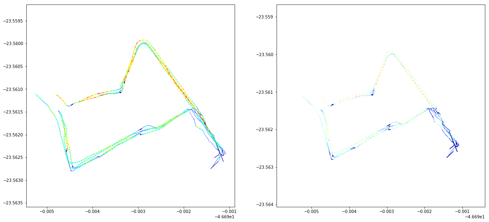
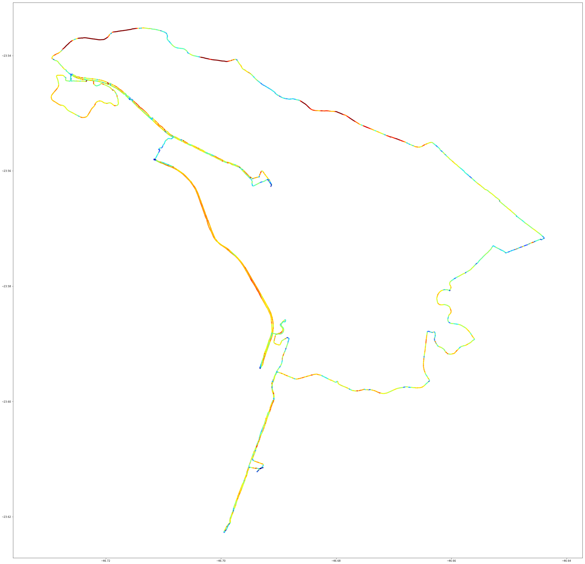

```python
import pickle as pk
import pandas as pd
import numpy as np
from sklearn.preprocessing import MinMaxScaler
import matplotlib.pyplot as plt
import matplotlib.colors as colors
from matplotlib.collections import LineCollection

```


```python
cachefile = open("grouped.pkl", 'rb')
data = pk.load(cachefile)
cachefile.close()
data.head()
```


<div>
<style>
    .dataframe thead tr:only-child th {
        text-align: right;
    }

    .dataframe thead th {
        text-align: left;
    }

    .dataframe tbody tr th {
        vertical-align: top;
    }
</style>
<table border="1" class="dataframe">
  <thead>
    <tr style="text-align: right;">
      <th></th>
      <th></th>
      <th></th>
      <th>point</th>
      <th>ride</th>
      <th>rider</th>
      <th>ilon</th>
      <th>ilat</th>
      <th>ielev</th>
      <th>itime</th>
      <th>flon</th>
      <th>flat</th>
      <th>felev</th>
      <th>ftime</th>
      <th>dist</th>
      <th>heading</th>
      <th>ddist</th>
      <th>delev</th>
      <th>climb</th>
    </tr>
    <tr>
      <th>rider</th>
      <th>ride</th>
      <th></th>
      <th></th>
      <th></th>
      <th></th>
      <th></th>
      <th></th>
      <th></th>
      <th></th>
      <th></th>
      <th></th>
      <th></th>
      <th></th>
      <th></th>
      <th></th>
      <th></th>
      <th></th>
      <th></th>
    </tr>
  </thead>
  <tbody>
    <tr>
      <th rowspan="5" valign="top">0</th>
      <th rowspan="5" valign="top">0</th>
      <th>0</th>
      <td>0.000000</td>
      <td>0.0</td>
      <td>0.0</td>
      <td>-46.691410</td>
      <td>-23.562747</td>
      <td>747.000000</td>
      <td>1.496510e+09</td>
      <td>-46.691405</td>
      <td>-23.562743</td>
      <td>747.054054</td>
      <td>1.496510e+09</td>
      <td>0.665167</td>
      <td>46.926654</td>
      <td>6.651668e-01</td>
      <td>0.054054</td>
      <td>0.081264</td>
    </tr>
    <tr>
      <th>1</th>
      <td>0.027027</td>
      <td>0.0</td>
      <td>0.0</td>
      <td>-46.691405</td>
      <td>-23.562743</td>
      <td>747.054054</td>
      <td>1.496510e+09</td>
      <td>-46.691401</td>
      <td>-23.562738</td>
      <td>747.108108</td>
      <td>1.496510e+09</td>
      <td>0.665167</td>
      <td>46.926654</td>
      <td>1.014265e-08</td>
      <td>0.054054</td>
      <td>0.081264</td>
    </tr>
    <tr>
      <th>2</th>
      <td>0.054054</td>
      <td>0.0</td>
      <td>0.0</td>
      <td>-46.691401</td>
      <td>-23.562738</td>
      <td>747.108108</td>
      <td>1.496510e+09</td>
      <td>-46.691396</td>
      <td>-23.562734</td>
      <td>747.162162</td>
      <td>1.496510e+09</td>
      <td>0.665167</td>
      <td>46.926654</td>
      <td>1.105071e-08</td>
      <td>0.054054</td>
      <td>0.081264</td>
    </tr>
    <tr>
      <th>3</th>
      <td>0.081081</td>
      <td>0.0</td>
      <td>0.0</td>
      <td>-46.691396</td>
      <td>-23.562734</td>
      <td>747.162162</td>
      <td>1.496510e+09</td>
      <td>-46.691392</td>
      <td>-23.562730</td>
      <td>747.216216</td>
      <td>1.496510e+09</td>
      <td>0.665167</td>
      <td>46.926654</td>
      <td>1.034407e-08</td>
      <td>0.054054</td>
      <td>0.081264</td>
    </tr>
    <tr>
      <th>4</th>
      <td>0.108108</td>
      <td>0.0</td>
      <td>0.0</td>
      <td>-46.691392</td>
      <td>-23.562730</td>
      <td>747.216216</td>
      <td>1.496510e+09</td>
      <td>-46.691387</td>
      <td>-23.562726</td>
      <td>747.270270</td>
      <td>1.496510e+09</td>
      <td>0.665167</td>
      <td>46.926655</td>
      <td>1.084928e-08</td>
      <td>0.054054</td>
      <td>0.081264</td>
    </tr>
  </tbody>
</table>
</div>


```python
n = 200
c = data.loc[0].loc[ride].head(n)
c = c.append(data.loc[0].loc[0].tail(n))
c = c.append(data.loc[0].loc[1].head(n//2))
c = c.append(data.loc[0].loc[1].tail(n))
c = c.append(data.loc[0].loc[2].head(n))
c = c.append(data.loc[0].loc[2].tail(n))
c = c.append(data.loc[0].loc[4].head(n//2))
c = c.append(data.loc[0].loc[4].tail(n))
norm = colors.Normalize()
cmap = plt.cm.get_cmap('jet')
rgba = cmap(norm(c.dist))

plt.figure(figsize=(20,20))
plt.subplot(221).quiver(c.ilon, c.ilat, c.flon-c.ilon, c.flat-c.ilat, color=rgba, units='xy', angles='xy', scale=1, pivot='tail')
plt.axis('equal')

plt.subplot(222).scatter(c.ilon, c.ilat, color=rgba, s=0.2)
plt.axis('equal')
plt.show()


c = data.loc[0].loc[0]

c['glat'] = np.around(c.ilat, 1)
c['glon'] = np.around(c.ilon, 1)
c['gdir'] = round(c.heading/45)*45

group = c.groupby(['glat', 'glon', 'gdir'], axis=0)
distancemean = pd.DataFrame(group['dist'].mean())
latmean = pd.DataFrame(group['ilat'].mean())
lonmean = pd.DataFrame(group['ilon'].mean())

c = c.merge(latmean, left_on=['glat', 'glon', 'gdir'], right_index=True, suffixes=('', 'mean'))
c = c.merge(lonmean, left_on=['glat', 'glon', 'gdir'], right_index=True, suffixes=('', 'mean'))
c = c.merge(distancemean, left_on=['glat', 'glon', 'gdir'], right_index=True, suffixes=('', 'mean'))
c = c.sort_values(['rider', 'itime'])

xy = np.array((c.ilon, c.ilat)).T #Nx2
xy = xy.reshape(-1, 1, 2)
segments = np.hstack([xy[:-1], xy[1:]])
g, ax = plt.subplots(figsize=(40,40))
collection = LineCollection(segments, cmap='jet', linewidth=4)
collection.set_array(norm(c.dist, 10))
ax.add_collection(collection)
ax.autoscale_view()
ax.axis('equal')
plt.show()


```








```python

```


```python

```
