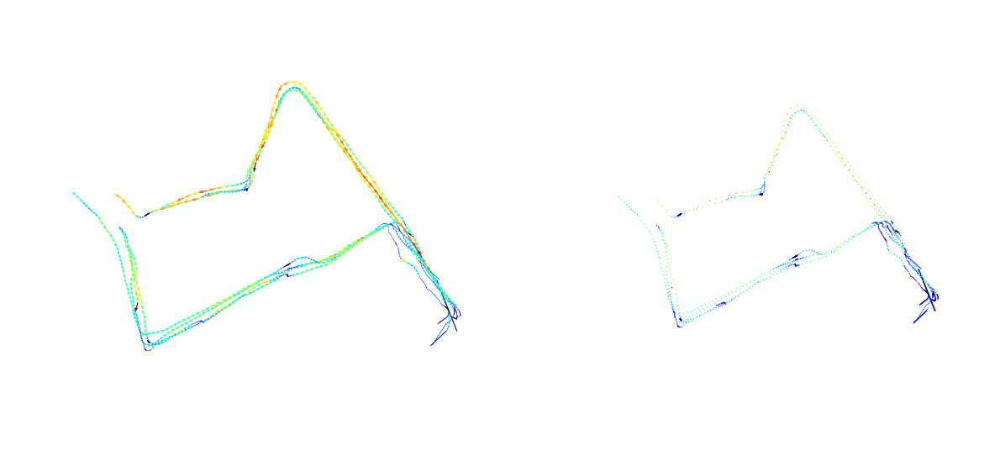
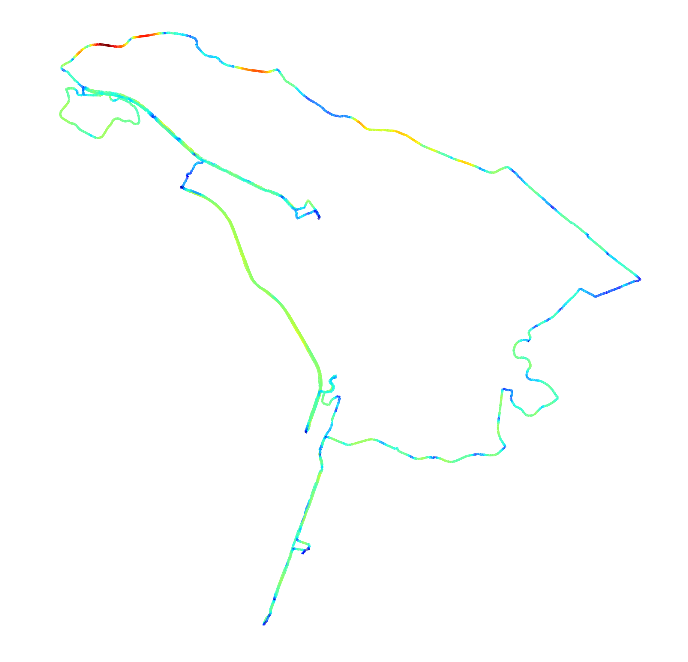

# Map views
Using data from the data processing step (https://github.com/sztelzer/Bike-Riding-Analysis/blob/master/Data%20Processing.md), we can now test various plot types of the data.


```python
import pickle as pk
import pandas as pd
import numpy as np
from sklearn.preprocessing import MinMaxScaler
import matplotlib.pyplot as plt
import matplotlib.colors as colors
from matplotlib.collections import LineCollection
```


```python
cachefile = open("grouped.pkl", 'rb')
data = pk.load(cachefile)
cachefile.close()
print(data.head())
```

                     point  ride  rider       ilon       ilat       ielev  \
    rider ride                                                              
    0     0    0  0.000000   0.0    0.0 -46.691410 -23.562747  747.000000   
               1  0.027027   0.0    0.0 -46.691405 -23.562743  747.054054   
               2  0.054054   0.0    0.0 -46.691401 -23.562738  747.108108   
               3  0.081081   0.0    0.0 -46.691396 -23.562734  747.162162   
               4  0.108108   0.0    0.0 -46.691392 -23.562730  747.216216   
    
                         itime       flon       flat       felev         ftime  \
    rider ride                                                                   
    0     0    0  1.496510e+09 -46.691405 -23.562743  747.054054  1.496510e+09   
               1  1.496510e+09 -46.691401 -23.562738  747.108108  1.496510e+09   
               2  1.496510e+09 -46.691396 -23.562734  747.162162  1.496510e+09   
               3  1.496510e+09 -46.691392 -23.562730  747.216216  1.496510e+09   
               4  1.496510e+09 -46.691387 -23.562726  747.270270  1.496510e+09   
    
                      dist    heading         ddist     delev     climb  
    rider ride                                                           
    0     0    0  0.665167  46.926654  6.651668e-01  0.054054  0.081264  
               1  0.665167  46.926654  1.014265e-08  0.054054  0.081264  
               2  0.665167  46.926654  1.105071e-08  0.054054  0.081264  
               3  0.665167  46.926654  1.034407e-08  0.054054  0.081264  
               4  0.665167  46.926655  1.084928e-08  0.054054  0.081264  


# Quiver, Scatter and Line Collection.
Quiver plots an arrows field, but should use simplifications to have less vectors.
Scatter plots are easy, disconnected, but also just points.
Line Collection are the best, but a little more complicated.


```python
n = 200
c = data.loc[0].loc[ride].head(n)
c = c.append(data.loc[0].loc[0].tail(n))
c = c.append(data.loc[0].loc[1].head(n//2))
c = c.append(data.loc[0].loc[1].tail(n))
c = c.append(data.loc[0].loc[2].head(n))
c = c.append(data.loc[0].loc[2].tail(n))
c = c.append(data.loc[0].loc[4].head(n//2))
c = c.append(data.loc[0].loc[4].tail(n))
norm = colors.Normalize()
cmap = plt.cm.get_cmap('jet')
rgba = cmap(norm(c.dist))

plt.figure(figsize=(20,20))
plt.subplot(221).quiver(c.ilon, c.ilat, c.flon-c.ilon, c.flat-c.ilat, color=rgba, units='xy', angles='xy', scale=1, pivot='tail')
plt.axis('equal')
plt.axis('off')

plt.subplot(222).scatter(c.ilon, c.ilat, color=rgba, s=0.2)
plt.axis('equal')
plt.axis('off')
plt.show()

c = data.loc[0].loc[0]

# create columns with rounded features
N = 20
c['ilonmean'] = np.convolve(c.ilon, np.ones((N,))/N, mode='same')
c['ilatmean'] = np.convolve(c.ilat, np.ones((N,))/N, mode='same')
c['distmean'] = np.convolve(c.dist, np.ones((N,))/N, mode='same')
c['dirmean'] = round(c.heading/45)*45


xy = np.array((c.ilon, c.ilat)).T #Nx2
xy = xy.reshape(-1, 1, 2)
segments = np.hstack([xy[:-1], xy[1:]])
g, ax = plt.subplots(figsize=(40,40))
collection = LineCollection(segments, cmap='jet', linewidth=8)
collection.set_array(norm(c.distmean))

ax.add_collection(collection)
ax.autoscale_view()
ax.axis('equal')
plt.axis('off')
plt.show()


```








```python

```
